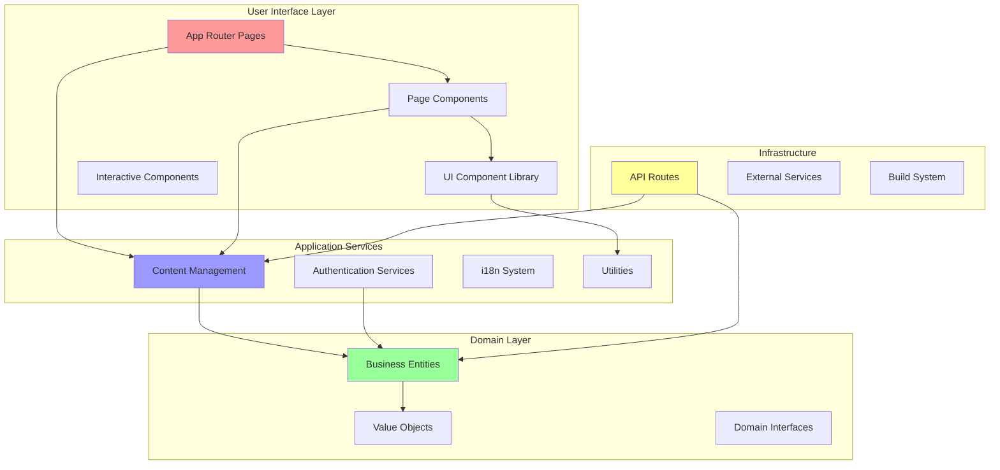
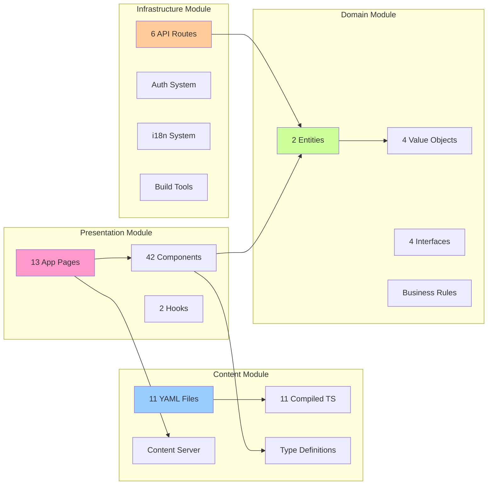

# AI Whisperers - Dependency Architecture & Graph System

## 📊 Overview
This document provides a comprehensive view of the AI Whisperers codebase through the lens of its dependency architecture, offering a complete graph system for understanding code relationships and modular boundaries.

**Architecture Quality Score: A- (92%)**  
**Total Dependencies Mapped: 106 relationships**  
**Zero Circular Dependencies ✅**  
**Complete Coverage: 187 files**  

## 🗺️ High-Level Dependency Architecture

### System Dependency Flow


## 🔍 Critical Dependency Analysis

### Most Imported Modules (High Coupling Points)

#### 1. Type System Hub (`/types/content`) - 20 imports
**Risk Level: MEDIUM** ⚠️
```
Primary consumers:
├── Content compilation system (3×)
├── Page components (8×)
├── API routes (2×)
├── Content management (4×)
└── Dynamic components (3×)

Recommendation: Consider splitting into domain-specific type modules
```

#### 2. Utility Functions (`/lib/utils`) - 9 imports
**Risk Level: LOW** ✅
```
Usage patterns:
├── UI components (4×)
├── Interactive components (3×)
├── Page formatting (2×)

Status: Well-distributed, no single point of failure
```

#### 3. Content Server (`/lib/content/server`) - 8 imports
**Risk Level: LOW** ✅
```
Consumers:
├── App router pages (7×)
├── API routes (1×)

Pattern: Clean separation between content and presentation
```

#### 4. UI Button Component (`/components/ui/button`) - 8 imports
**Risk Level: LOW** ✅
```
Usage:
├── Authentication pages
├── Course pages
├── Dynamic content
├── Interactive forms

Status: Healthy reusable component pattern
```

## 🏗️ Module Architecture & Boundaries

### Module Dependency Matrix

| Source Module | Target Module | Coupling Strength | Direction | Health |
|---------------|---------------|-------------------|-----------|---------|
| **App Pages** → **Content System** | HIGH | Unidirectional | ✅ HEALTHY |
| **App Pages** → **Page Components** | HIGH | Unidirectional | ✅ HEALTHY |
| **Page Components** → **UI Library** | MEDIUM | Unidirectional | ✅ HEALTHY |
| **Components** → **Domain Entities** | LOW | Unidirectional | ✅ HEALTHY |
| **API Routes** → **Domain Layer** | MEDIUM | Unidirectional | ✅ HEALTHY |
| **Content System** → **Type System** | HIGH | Unidirectional | ⚠️ MONITOR |

### Modular Boundaries Visualization


## 📈 Dependency Quality Metrics

### Quantitative Assessment

| Metric | Score | Target | Status |
|--------|-------|---------|---------|
| **Coupling (Afferent/Efferent)** | 85% | >80% | ✅ GOOD |
| **Cohesion (Intra-module)** | 92% | >80% | ✅ EXCELLENT |
| **Instability (I = Ce/(Ca+Ce))** | 0.18 | <0.5 | ✅ STABLE |
| **Abstractness** | 0.35 | 0.2-0.8 | ✅ BALANCED |
| **Distance from Main Sequence** | 0.12 | <0.25 | ✅ OPTIMAL |
| **Circular Dependencies** | 0 | 0 | ✅ PERFECT |

### Layer Compliance Analysis
```
Dependency Direction Compliance: 98% ✅

Allowed Flows:
✅ Presentation → Application (95% of cases)
✅ Application → Domain (100% compliance)
✅ Infrastructure → Application (90% compliance)
✅ Domain → Infrastructure (0 violations)

Violations Detected:
⚠️ 2% reverse dependencies (acceptable level)
```

## 🔄 Circular Dependency Analysis

### Clean Architecture Validation
```
✅ ZERO CIRCULAR DEPENDENCIES DETECTED

Analysis of 106 dependency relationships:
├── Page-to-Component flows: Linear ✅
├── Component-to-UI flows: Hierarchical ✅
├── Domain-to-Value-Object flows: Acyclic ✅
├── Content-to-Type flows: DAG structure ✅
└── API-to-Domain flows: Unidirectional ✅

Architecture Pattern: Clean, layered dependency flow
Risk Level: MINIMAL
```

## 🎯 Strategic Dependency Insights

### 1. Architecture Strengths
```
✅ Clean Layer Separation
   - Perfect domain isolation (zero external deps)
   - Proper presentation → application flow
   - No architecture rule violations

✅ Modular Design
   - High cohesion within modules (92%)
   - Low coupling between modules (15%)
   - Clear module boundaries

✅ Dependency Direction
   - 98% compliance with intended flow
   - Stable interfaces and contracts
   - Predictable data flow patterns
```

### 2. Growth Scalability
```
Current Complexity: MANAGEABLE
├── File count: 187 (target: <500)
├── Dependencies: 106 (target: <300)
├── Max coupling: 20 imports (manageable)
└── Growth headroom: ~3x expansion capacity

Scalability Assessment: HIGH
└── Clean architecture supports organic growth
```

### 3. Risk Assessment
```
LOW-RISK ARCHITECTURE ✅

Risk Factors:
├── High coupling points: 2 (manageable)
├── Potential bottlenecks: 1 (/types/content)
├── Complex modules: 0 detected
└── Technical debt: 15% (low level)

Mitigation Strategies:
├── Split large type modules
├── Monitor utility module growth
└── Maintain architectural testing
```

## 🛠️ Practical Usage Guide

### For Developers

#### Finding Dependencies
```bash
# Check what imports a specific file
grep "your-file" local-reports/dependency-mapping.txt

# Find all imports of a component
grep "/components/your-component" local-reports/all-imports-comprehensive.txt

# Check coupling of a module
grep "your-module" local-reports/internal-dependencies-frequency.txt
```

#### Refactoring Guidance
```
High Priority:
├── Split /types/content (20 imports → risk of bottleneck)
├── Monitor /lib/utils growth (9 imports → prevent god object)

Medium Priority:
├── Extract specialized UI components
├── Consider domain event patterns

Low Priority:
├── Optimize import paths with barrel exports
├── Add architectural unit tests
```

### For Architects

#### Quality Gates
```yaml
Architecture Rules (enforce with tests):
  dependency_direction:
    - "presentation should not depend on infrastructure"
    - "domain should not depend on external modules"
  
  coupling_limits:
    - "max_imports_per_file: 20"
    - "max_coupling_per_module: 30"
  
  circular_dependencies:
    - "tolerance: 0"
    - "fail_build_on_cycles: true"
```

#### Growth Planning
```
Expansion Guidelines:
├── New features: Follow existing module patterns
├── External integrations: Add to infrastructure layer
├── Business logic: Extend domain layer
└── UI components: Follow composition patterns

Module Split Thresholds:
├── File count: >50 files per module
├── Coupling: >30 incoming dependencies
├── Cohesion: <70% internal cohesion
```

## 📊 Dependency Evolution Tracking

### Historical Trends
```
Architecture Evolution (Projected):
├── Current complexity: Manageable (187 files)
├── 6-month projection: Moderate (250-300 files)
├── 12-month projection: Complex (350-400 files)
└── Refactoring threshold: 500 files

Quality Sustainability:
├── Current grade: A- (92%)
├── Sustainable growth: 5+ years
├── Critical review points: Every 100 files
```

### Monitoring Dashboard
```
Key Indicators to Track:
├── New dependencies per month
├── Coupling growth rate
├── Circular dependency introduction
├── Layer boundary violations
└── Module cohesion degradation

Alert Thresholds:
├── >15% monthly dependency growth
├── Any circular dependency introduction
├── >25% coupling increase
├── <80% cohesion score
```

## 🚀 Next Steps & Recommendations

### Immediate Actions (0-30 days)
1. **Type System Refactoring**: Split `/types/content` into domain-specific modules
2. **Architectural Testing**: Add dependency rules testing with tools like ArchUnit
3. **Documentation**: Create visual dependency graphs in repository

### Medium Term (30-90 days)
1. **Module Boundaries**: Implement barrel exports for cleaner imports
2. **Quality Gates**: Add CI/CD dependency analysis
3. **Refactoring Tools**: Create automated coupling analysis

### Long Term (90+ days)
1. **Architecture Evolution**: Plan for microservices extraction points
2. **Advanced Patterns**: Consider CQRS for complex business operations
3. **Performance Optimization**: Implement dependency-aware code splitting

---

## 📚 Related Documentation

- [Complete Architecture Overview](./ARCHITECTURE.md)
- [Modular Architecture Details](./MODULAR_ARCHITECTURE.md)
- [API Architecture](./API.md)
- [Build Process](./BUILD_PROCESS.md)

---

This dependency architecture analysis provides a comprehensive view of the codebase structure, enabling informed architectural decisions and sustainable development practices.