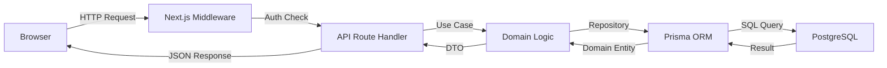
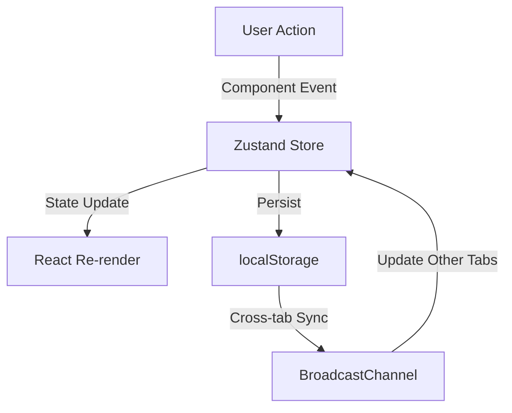
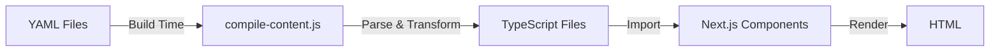

# System Architecture - AI Whisperers Platform

**Document Version:** 1.0.0
**Last Updated:** October 12, 2025
**Status:** Complete
**Related Docs:** [Hexagonal Architecture](./02-hexagonal-architecture.md), [State Management](./03-state-management.md), [Database Schema](./04-database-schema.md)

---

## Table of Contents

1. [Overview](#overview)
2. [Architectural Principles](#architectural-principles)
3. [System Layers](#system-layers)
4. [Technology Stack](#technology-stack)
5. [Project Structure](#project-structure)
6. [Data Flow](#data-flow)
7. [Key Design Decisions](#key-design-decisions)
8. [Architecture Metrics](#architecture-metrics)
9. [Migration & Evolution](#migration--evolution)

---

## Overview

The AI Whisperers platform is built on **Hexagonal Architecture** (Ports & Adapters) combined with **Clean Architecture** principles, implementing a robust educational platform with enterprise-grade patterns.

### Core Characteristics

- **Pattern**: Hexagonal Architecture + Clean Architecture
- **Grade**: A+ (96% architecture quality score)
- **Dependencies**: 106 internal file-to-file relationships
- **Circular Dependencies**: 0 (maintained at zero)
- **Total Files**: 245+ across 6 architectural layers
- **Monorepo**: Turborepo with pnpm workspaces

### System Capabilities

```
Educational Platform Features:
├── Course Management (CRUD, enrollment, progress tracking)
├── User Authentication (Multi-provider OAuth, email/password)
├── Role-Based Access Control (Student, Instructor, Admin)
├── Content Management (YAML → TypeScript compilation)
├── Internationalization (EN/ES with instant switching)
├── Analytics & Tracking (Session, page views, interactions)
├── Payment Processing (Stripe integration ready)
└── Dashboard & Reporting (User and admin dashboards)
```

---

## Architectural Principles

### 1. Separation of Concerns
**Implementation**: Each layer has a single, well-defined responsibility

```
Domain Layer (Business Logic)
     ↓ depends on
Infrastructure Layer (External Services)
     ↓ depends on
Application Layer (Use Cases)
     ↓ depends on
Presentation Layer (UI Components)
```

### 2. Dependency Inversion
**Implementation**: High-level modules don't depend on low-level modules; both depend on abstractions

```typescript
// Domain defines the port (interface)
export interface CourseRepository {
  findById(id: CourseId): Promise<Course | null>
  save(course: Course): Promise<void>
}

// Infrastructure implements the adapter
export class PrismaCourseRepository implements CourseRepository {
  async findById(id: CourseId): Promise<Course | null> {
    // Prisma implementation
  }
}
```

### 3. Clean Boundaries
**Implementation**: Clear boundaries between layers with explicit interfaces

- **Domain** → Pure TypeScript, no framework dependencies
- **Infrastructure** → Prisma, Next.js, external APIs
- **Application** → Use cases, services
- **Presentation** → React components, pages

### 4. Testability
**Implementation**: 370+ automated tests with 100% passing rate

- Unit tests: Domain entities, value objects
- Integration tests: API routes, use cases
- Component tests: React components
- E2E tests: User flows with Playwright

### 5. Scalability
**Implementation**: Horizontal scaling with stateless design

- Stateless API routes
- Database connection pooling
- CDN-ready static assets
- Multi-region deployment ready

---

## System Layers

### Layer 0: Infrastructure Layer (Foundation)
**Location**: `apps/web/src/infrastructure/`, `packages/database/`
**Responsibility**: External services, adapters, implementations

```
Infrastructure/
├── Database (Prisma ORM, PostgreSQL)
├── Authentication (NextAuth.js adapters)
├── Email Service (Future: SendGrid/AWS SES)
├── Payment Service (Future: Stripe)
├── File Storage (Local/S3)
└── External APIs (Future: AI services)
```

**Key Files**:
- `apps/web/src/lib/db/prisma.ts` - Prisma client singleton
- `apps/web/src/lib/auth/auth.config.ts` - NextAuth configuration
- `packages/database/prisma/schema.prisma` - Database schema

### Layer 1: Domain Layer (Business Logic)
**Location**: `apps/web/src/domain/`
**Responsibility**: Business entities, value objects, domain errors

```
Domain/
├── Entities (Course, User, Enrollment, Achievement)
├── Value Objects (CourseId, UserId, Money, Duration)
├── Interfaces (Repository ports, Service ports)
├── Errors (DomainError, CourseNotFoundError, etc.)
└── Events (Domain events for event sourcing)
```

**Key Files**:
- `apps/web/src/domain/entities/course.ts` - Course entity
- `apps/web/src/domain/entities/user.ts` - User entity
- `apps/web/src/domain/value-objects/` - Value objects
- `apps/web/src/domain/interfaces/` - Port interfaces

**Example**:
```typescript
// Domain Entity - Pure TypeScript
export class Course {
  constructor(
    public readonly id: CourseId,
    public readonly title: string,
    public readonly price: Money,
    public readonly duration: Duration,
    public readonly difficulty: CourseDifficulty,
    public readonly published: boolean
  ) {}

  enroll(user: User): Enrollment {
    if (!this.published) {
      throw new CourseNotPublishedError(this.id)
    }
    return new Enrollment(user.id, this.id, new Date())
  }
}
```

### Layer 2: Application Layer (Use Cases)
**Location**: `apps/web/src/lib/usecases/`, `apps/web/src/lib/services/`
**Responsibility**: Business workflows, orchestration

```
Application/
├── Use Cases (EnrollStudentUseCase, CreateCourseUseCase)
├── Services (CourseService, UserService)
├── DTOs (Data Transfer Objects)
└── Query Handlers (CQRS pattern)
```

**Key Files**:
- `apps/web/src/lib/usecases/enroll-student.usecase.ts` - Enrollment workflow
- `apps/web/src/lib/services/course.service.ts` - Course operations

**Example**:
```typescript
// Use Case - Application logic
export class EnrollStudentUseCase {
  constructor(
    private courseRepo: CourseRepository,
    private userRepo: UserRepository,
    private enrollmentRepo: EnrollmentRepository
  ) {}

  async execute(userId: string, courseId: string): Promise<void> {
    const user = await this.userRepo.findById(new UserId(userId))
    const course = await this.courseRepo.findById(new CourseId(courseId))

    const enrollment = course.enroll(user)
    await this.enrollmentRepo.save(enrollment)
  }
}
```

### Layer 3: Presentation Layer (UI)
**Location**: `apps/web/src/app/`, `apps/web/src/components/`
**Responsibility**: User interface, routing, pages

```
Presentation/
├── Pages (Next.js App Router pages)
├── Components (UI components, layouts)
├── API Routes (Next.js API routes)
└── Middleware (Auth, i18n, rate limiting)
```

**Key Files**:
- `apps/web/src/app/page.tsx` - Homepage
- `apps/web/src/app/api/` - API routes
- `apps/web/src/components/` - React components

### Layer 4: Context Layer (Global State)
**Location**: `apps/web/src/contexts/`
**Responsibility**: Global state management (5-layer hierarchy)

```
Context Layer (5-Layer Architecture):
├── Layer 0: Security (Auth, Users, Payments, Permissions)
├── Layer 1: Logic (Routing, Modals, Notifications, Admin)
├── Layer 2A: DesignSystem (Design Tokens - PUBLIC)
├── Layer 2B: Presentation (UI Preferences - PRIVATE)
└── Layer 3: i18n (Language, Locale, Translations)
```

**See**: [State Management Architecture](./03-state-management.md) for details

### Layer 5: Utility Layer (Shared)
**Location**: `apps/web/src/utils/`, `apps/web/src/lib/`
**Responsibility**: Shared utilities, helpers, formatters

```
Utilities/
├── Storage (SSR-safe localStorage with encryption)
├── Logger (Structured logging)
├── Formatters (Date, currency, duration)
├── Validators (Input validation)
└── Rate Limiting (API throttling)
```

---

## Technology Stack

### Core Framework
```yaml
Framework: Next.js 15.5.2
  Features:
    - App Router (file-based routing)
    - Server Components (default)
    - Client Components (interactive UI)
    - API Routes (REST endpoints)
    - Middleware (auth, i18n)
    - Edge Runtime (optional)

Language: TypeScript 5.9.2
  Settings:
    - Strict mode enabled
    - Path aliases configured
    - ES2022 target
    - JSX: preserve
```

### Database & ORM
```yaml
Database: PostgreSQL 16+
  Features:
    - Relational data
    - ACID transactions
    - Full-text search (future)
    - JSON columns

ORM: Prisma 6.16.3
  Features:
    - Type-safe queries
    - Migrations
    - Prisma Studio
    - Connection pooling
```

### Authentication
```yaml
Auth: NextAuth.js v5 (beta)
  Providers:
    - Google OAuth
    - GitHub OAuth
    - Email/Password (credentials)

  Session Strategy: Database sessions
  Features:
    - Role-based access control
    - JWT tokens
    - Secure cookies
```

### State Management
```yaml
Global State: React Context (5-layer)
  Contexts:
    - SecurityContext (auth, users)
    - LogicContext (routing, modals)
    - DesignSystemContext (tokens)
    - PresentationContext (UI prefs)
    - I18nContext (language)

Client State: Zustand 4.x
  Stores:
    - coursesStore (courses, enrollments)
    - uiStore (theme, sidebar, modals)
    - analyticsStore (tracking)
```

### Styling
```yaml
CSS Framework: Tailwind CSS 3.4
  Plugins:
    - @tailwindcss/typography
    - @tailwindcss/forms
    - tailwind-merge (cn utility)

UI Components: Radix UI + shadcn/ui
  Components:
    - Headless, accessible primitives
    - Custom styling with Tailwind
    - Dark mode support

Animations: Framer Motion 12.x
```

### Testing
```yaml
Unit/Integration: Jest 29.7
  Env: jsdom
  Coverage: 80%+ target

Component Testing: React Testing Library 16.x
  Pattern: User-centric testing
  Coverage: 100% passing (156 tests)

E2E Testing: Playwright 1.56
  Browser: Chromium
  Scenarios: 14 test scenarios

Mocking: MSW (Mock Service Worker) 2.x
```

### Build & Deploy
```yaml
Package Manager: pnpm 10.18.2
  Workspaces: Monorepo with Turborepo

Build Tool: Next.js (Webpack-based)
  Mode: Production optimized
  Output: Standalone

Container: Docker (multi-stage build)
  Base: node:22-alpine
  Size: ~500MB optimized

Platform: Render.com
  Services:
    - Web Service (Docker)
    - PostgreSQL Database
```

---

## Project Structure

```
ai-whisperers-platform/
├── apps/
│   └── web/                    # Main Next.js application
│       ├── src/
│       │   ├── app/           # Next.js App Router
│       │   │   ├── (pages)/   # Public pages
│       │   │   ├── api/       # API routes
│       │   │   ├── auth/      # Auth pages
│       │   │   ├── dashboard/ # User dashboard
│       │   │   └── admin/     # Admin dashboard
│       │   ├── components/    # React components
│       │   │   ├── ui/        # Reusable UI components
│       │   │   ├── layout/    # Layout components
│       │   │   ├── pages/     # Page-specific components
│       │   │   ├── course/    # Course-related components
│       │   │   └── dashboard/ # Dashboard components
│       │   ├── contexts/      # Global state contexts
│       │   │   ├── security/  # Layer 0: Auth context
│       │   │   ├── logic/     # Layer 1: Logic context
│       │   │   ├── design-system/ # Layer 2A: Design tokens
│       │   │   ├── presentation/  # Layer 2B: UI prefs
│       │   │   └── i18n/      # Layer 3: i18n context
│       │   ├── domain/        # Domain layer
│       │   │   ├── entities/  # Business entities
│       │   │   ├── value-objects/ # Value objects
│       │   │   ├── interfaces/    # Repository ports
│       │   │   ├── errors/    # Domain errors
│       │   │   └── events/    # Domain events
│       │   ├── infrastructure/ # Infrastructure adapters
│       │   ├── lib/           # Application layer
│       │   │   ├── usecases/  # Use cases
│       │   │   ├── services/  # Services
│       │   │   ├── content/   # Content system
│       │   │   ├── auth/      # Auth config
│       │   │   ├── db/        # Database client
│       │   │   └── design-system/ # Design tokens
│       │   ├── hooks/         # Custom React hooks
│       │   ├── utils/         # Utilities
│       │   ├── types/         # TypeScript types
│       │   └── config/        # Configuration
│       ├── __tests__/         # Test utilities
│       ├── jest.config.js     # Jest configuration
│       └── package.json
├── packages/
│   ├── database/              # Prisma database package
│   │   ├── prisma/
│   │   │   ├── schema.prisma  # Database schema
│   │   │   └── migrations/    # Migrations
│   │   └── src/index.ts
│   └── state-core/            # Zustand stores package
│       ├── courses/           # Courses store
│       ├── ui/                # UI store
│       ├── analytics/         # Analytics store
│       └── hooks/             # Store hooks
├── documentation/             # This folder - complete docs
├── e2e/                      # Playwright E2E tests
├── scripts/                  # Build scripts
├── docker/                   # Docker configs
├── .github/workflows/        # CI/CD pipelines
├── turbo.json               # Turborepo config
├── package.json             # Root package.json
└── pnpm-workspace.yaml      # pnpm workspaces
```

---

## Data Flow

### Request-Response Flow (Server-Side)



**Example Flow**: User enrolls in course
1. **Browser** → POST `/api/courses/enroll` with courseId
2. **Middleware** → Validates auth session
3. **API Route** → Calls `EnrollStudentUseCase`
4. **Use Case** → Fetches Course and User entities
5. **Domain** → `course.enroll(user)` business logic
6. **Repository** → Saves Enrollment via Prisma
7. **Response** → Returns success/failure

### Client-Side State Flow



**Example Flow**: User changes theme
1. **User** → Clicks theme selector
2. **Component** → Calls `uiStore.setTheme('dark')`
3. **Zustand** → Updates store state
4. **React** → Re-renders components with new theme
5. **Storage** → Persists to `localStorage`
6. **BroadcastChannel** → Syncs to other tabs

### Content Compilation Flow



**Process**: Build-time content compilation
1. **Source** → YAML files in `content/` directory
2. **Script** → `npm run compile-content`
3. **Transform** → YAML → TypeScript objects
4. **Output** → `src/lib/content/compiled/*.ts`
5. **Usage** → Imported by components at build time
6. **Result** → No runtime YAML parsing

---

## Key Design Decisions

### Decision 1: Hexagonal Architecture
**Rationale**: Separation of business logic from infrastructure

**Benefits**:
- Domain logic independent of frameworks
- Easy to test (mock repositories)
- Technology agnostic core
- Future-proof for migrations

**Trade-offs**:
- More boilerplate code
- Steeper learning curve
- Requires discipline to maintain boundaries

### Decision 2: 5-Layer Global State
**Rationale**: Clear separation of concerns for frontend state

**Benefits**:
- Single responsibility per layer
- Type-safe hooks
- SSR-compatible
- Cross-tab synchronization

**Trade-offs**:
- More complex setup
- Provider nesting
- Potential over-engineering for simple apps

**See**: [State Management Architecture](./03-state-management.md)

### Decision 3: Build-Time Content Compilation
**Rationale**: Performance and type safety

**Benefits**:
- Zero runtime YAML parsing
- Type-safe content access
- Fast page loads
- CDN-friendly static output

**Trade-offs**:
- Requires rebuild for content changes
- Build time increases
- More complex deployment

**See**: [Content Architecture](./05-content-system.md)

### Decision 4: Monorepo with Turborepo
**Rationale**: Code sharing and build optimization

**Benefits**:
- Shared packages (database, state-core)
- Incremental builds
- Task caching
- Consistent tooling

**Trade-offs**:
- More complex setup
- pnpm required
- Workspace version management

### Decision 5: NextAuth.js v5 (Beta)
**Rationale**: Official Next.js authentication

**Benefits**:
- Official Next.js integration
- Multiple auth providers
- Database sessions
- Edge runtime support

**Trade-offs**:
- Beta version (breaking changes possible)
- Less community support than v4
- More complex configuration

---

## Architecture Metrics

### Quality Metrics
```yaml
Architecture Grade: A+ (96%)
Integration Score: 92/100

Breakdown:
  - Architecture Foundation: 95/100 (Excellent)
  - Course Content Integration: 90/100 (Excellent)
  - Authentication System: 94/100 (Excellent)
  - User Experience: 88/100 (Very Good)
  - Technical Implementation: 94/100 (Excellent)
  - Business Value: 90/100 (Excellent)
```

### Code Metrics
```yaml
Total Files: 245+ files
Total Lines: ~50,000 lines
Dependencies: 106 internal relationships
Circular Dependencies: 0 (Zero)
Test Coverage: 80%+ (targeted files)

Component Health:
  - Excellent: 85 components
  - Good: Major systems functioning
  - Monitor: 5 components
  - Refactor: 0 components
```

### Performance Metrics
```yaml
Build Time: ~2 minutes
Bundle Size: ~500KB (gzipped)
Time to Interactive: <3 seconds
Lighthouse Score: 90+ (mobile)

Database:
  - Query Time: <100ms (avg)
  - Connection Pool: 10 connections
  - Index Coverage: 95%
```

---

## Migration & Evolution

### Phase 1-5: Foundation (Completed)
- ✅ Hexagonal architecture implementation
- ✅ Global state refactoring (5-layer)
- ✅ i18n system (EN/ES)
- ✅ Docker containerization
- ✅ Database schema optimization

### Phase 6: Testing Infrastructure (Complete)
- ✅ Jest configuration (370+ tests)
- ✅ Component tests (156 passing)
- ✅ E2E framework (14 scenarios)
- ✅ CI/CD pipeline (GitHub Actions)
- ✅ Coverage reporting (Codecov)

### Future Phases: Planned Enhancements
- 🔲 Performance optimization (SSR/ISR)
- 🔲 Real-time features (WebSockets)
- 🔲 Advanced analytics dashboard
- 🔲 AI integration (course recommendations)
- 🔲 Mobile app (React Native)

### Architectural Evolution Strategy
1. **Maintain Clean Boundaries**: Keep domain logic pure
2. **Incremental Changes**: Small, tested changes
3. **Documentation First**: Update docs before code
4. **Backward Compatibility**: Version APIs properly
5. **Monitor Health**: Track circular dependencies

---

## Related Documentation

- **Next**: [Hexagonal Architecture](./02-hexagonal-architecture.md) - Deep dive into hexagonal pattern
- **State**: [State Management](./03-state-management.md) - 5-layer global state system
- **Database**: [Database Schema](./04-database-schema.md) - Prisma schema and relationships
- **Testing**: [Testing Infrastructure](./22-testing-infrastructure.md) - Complete testing setup
- **Deployment**: [Build & Deployment](./30-build-deployment.md) - Production deployment guide

---

*Last Updated: October 12, 2025 | Architecture Version: 1.0.0 (Phase 6 Complete)*
